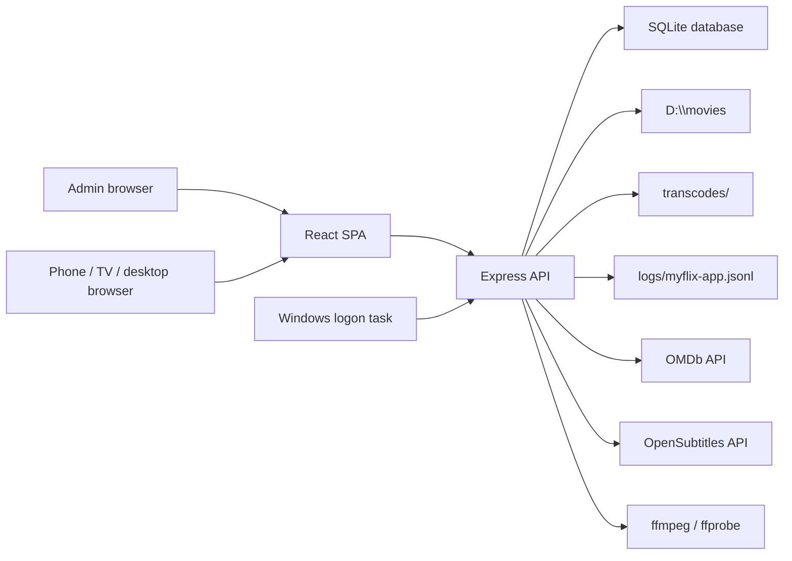
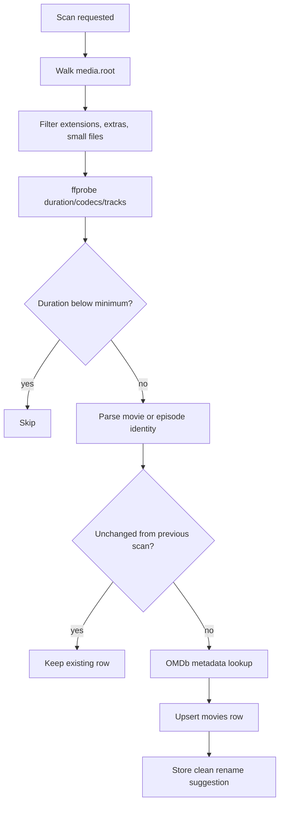
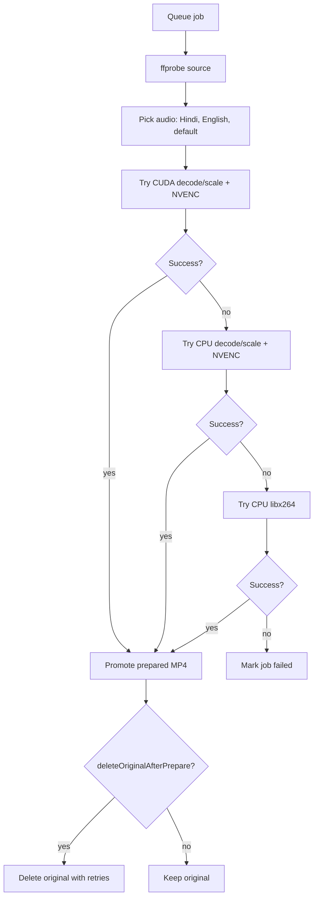

# MyFlix Design Document

This document records how MyFlix is built today, why the main design decisions were made, and what tradeoffs are currently accepted.

## Goals

MyFlix is a home-network media server for a personal movie and TV library.

Primary goals:

- Stream local movies and TV episodes to desktop, phone, tablet, and TV browsers.
- Hide media that is not ready rather than showing titles that fail on playback.
- Convert incompatible media once, then stream prepared files directly.
- Avoid normal-path live transcoding.
- Keep setup practical on a Windows home server.
- Preserve user login sessions across browser restarts.
- Provide enough admin visibility to understand scans, conversions, users, sessions, and logs.

Non-goals:

- Public internet hosting without a reverse proxy and additional hardening.
- Full DRM, adaptive bitrate packaging, or commercial streaming CDN behavior.
- Perfect metadata matching for every obscure file naming convention.
- Preserving every source stream in the browser-compatible output.

## System Context



## Runtime Architecture

The app is one Node.js process:

- `server.js` starts Express.
- React production assets are served from `client/build`.
- API routes are mounted under `/api/*`.
- SQLite is opened from `database/myflix.db`.
- Startup work schedules scanning, session cleanup, original cleanup, and optional conversion queue startup.
- The Windows service script starts the Node process hidden at user logon.

Main backend modules:

- `lib/config.js`: merges defaults, base config, ignored local config, and environment variables.
- `lib/libraryScanner.js`: scans `media.root`, detects titles, probes media, enriches metadata.
- `lib/transcoder.js`: playback profiles, prepared MP4 conversion, HLS fallback, subtitle extraction, conversion queue.
- `lib/opensubtitles.js`: OpenSubtitles search, login, retrying download flow, WebVTT sidecar writing.
- `lib/sessions.js`: server-side session tracking, cleanup, revocation.
- `lib/logger.js`: structured JSON logs and request logging.

Main frontend modules:

- `client/src/pages/Browse.jsx`: shelves, genre groups, top rated, continue watching, TV series cards.
- `client/src/pages/Watch.jsx`: playback, audio/subtitle menus, episode selection, seek controls.
- `client/src/pages/Admin.jsx`: scanning, movie management, conversions, users, sessions.
- `client/src/contexts/AuthContext.js`: login state and token refresh.
- `client/src/utils/api.js`: Axios API client.

## Configuration Model

Config priority:

1. Built-in defaults in `lib/config.js`
2. `config/myflix.config.json`
3. `config/myflix.local.json`
4. Environment variables

`config/myflix.local.json` is the intended place for secrets and machine-specific values. It is ignored by Git.

Important config sections:

- `server`: host, HTTP port, HTTPS certificate paths, redirect behavior.
- `auth`: token lifetime, idle timeout, cleanup interval.
- `media`: library root, scan policy, minimum file size/duration, rename behavior.
- `metadata`: OMDb keys and scan request limits.
- `subtitles`: language preferences and OpenSubtitles credentials.
- `transcoding`: FFmpeg paths, concurrency-related settings, original deletion policy.
- `service`: Windows task behavior and log paths.

## Data Model

SQLite tables are created and migrated opportunistically at startup.

Core tables:

- `users`: account records, password hashes, admin flag.
- `user_sessions`: server-side session records for active/idle/revoked sessions.
- `movies`: both movie and episode records. TV fields include `media_type`, `series_title`, `season_number`, `episode_number`, and `episode_title`.
- `watch_history`: per-user watch time and completion.
- `favorites`: per-user saved titles.
- `media_conversions`: completed conversion records and original deletion status.
- `background_conversion_jobs`: queue state, progress, encoder choice, errors.
- `app_settings`: small persistent flags such as background conversion paused state.
- `categories` and `movie_categories`: legacy/category support.

Key decision:

- Episodes are rows in `movies`, not a separate table. The library API groups them into series/seasons for the frontend.

Why:

- It keeps playback, history, favorites, subtitles, and conversions identical for movies and episodes.

Tradeoff:

- Some API code must group and summarize episode rows before returning browse data.

## Scan Pipeline



Normal scans are incremental. Force scans reprocess files even if unchanged.

The scanner avoids indexing:

- files shorter than `media.minDurationMinutes`
- common extras and bonus material
- scanner-created duplicates where a better longer/larger file already exists
- missing files after a cleanup pass

Rename behavior:

- `suggest`: store suggested clean paths only.
- `apply`: move/rename files. This should be used carefully.

## Library Availability Model

The browse API does not return every indexed item.

An item is visible when:

- it has an available prepared conversion, or
- its latest conversion job completed with an output file, or
- it was skipped because it was already device-safe.

An item is hidden when:

- it is queued or running conversion,
- conversion failed,
- no compatibility signal exists,
- the source file is missing.

This prevents the main UI from showing files that are likely to fail on mobile/remote playback.

## Playback Model

The client asks the backend for a playback profile:

```text
GET /api/stream/:id/playback
```

The backend returns one of:

- `direct`: stream the current file directly.
- `prepared`: stream a prepared MP4 variant.
- `hls`: legacy/live fallback when needed.
- not-ready state: the client waits instead of trying an unsupported original.

Prepared/direct MP4 streaming uses HTTP range requests so the browser can seek.

The watch page:

- requests compatible playback automatically for mobile/LAN clients,
- starts at the top of the page when a new title opens,
- supports play/pause, seek, left/right arrow seeking, fullscreen, audio selection, subtitles, and episode selection.

## Conversion Pipeline

The current normal path is offline preparation, not real-time transcoding.



Prepared output target:

- H.264 MP4
- AAC stereo
- max 1080p
- fast-start
- no embedded subtitles/data/chapters
- browser/mobile seekable

The queue runs one job at a time by default. This avoids saturating disks and keeps FFmpeg process management simpler.

Why not live transcode normally:

- Live transcoding caused seek failures and high CPU.
- One-time preparation creates stable, reusable outputs.
- Mobile/TV playback becomes a simple static/range MP4 stream.

## Original File Deletion

Original deletion is controlled by config:

- `deleteOriginalAfterPrepare`
- `deleteOriginalWithMultipleAudio`
- `deleteOriginalWithEmbeddedSubtitles`

Deletion happens only after:

- FFmpeg successfully creates the prepared MP4,
- the prepared MP4 is promoted beside the source,
- SQLite is updated to point at the replacement,
- sidecar subtitles are extracted when possible.

The conversion log records source path, replacement path, sizes, track counts, codecs, and status.

## Subtitle Design

Subtitle sources:

- sidecar `.srt` and `.vtt`
- extractable embedded text subtitle streams
- OpenSubtitles downloads

Unsupported embedded formats such as PGS image subtitles are shown as unsupported because browsers cannot render them directly.

OpenSubtitles search uses:

- movie hash
- filename/title
- IMDb ID
- season and episode numbers
- preferred languages

Downloads:

- retry transient network failures,
- convert SRT to WebVTT,
- write `.vtt` sidecars next to the media file.

## Authentication And Sessions

Authentication uses JWT plus server-side session records.

Login flow:

1. User logs in.
2. Backend creates a row in `user_sessions`.
3. Backend signs a JWT containing the session ID.
4. Browser stores the token.
5. Authenticated requests update `last_seen_at`.

Session cleanup:

- expired sessions are revoked,
- idle sessions older than `auth.idleMinutes` are revoked,
- admins can terminate sessions manually.

Admin protections:

- most write/admin routes require `authenticateToken` plus `requireAdmin`.
- login/register are rate limited more strictly than streaming endpoints.

## HTTPS Design

Local HTTPS is optional but useful for mobile browsers and persistent sessions.

The helper script creates:

- a private MyFlix root CA,
- a server certificate,
- config entries for HTTPS,
- current-user Windows trust for the root CA.

Other devices must trust the generated root CA themselves. The app does not try to bypass browser certificate security.

## Windows Service Design

The service script is a PowerShell wrapper around Windows Task Scheduler.

Responsibilities:

- install/uninstall a current-user logon task,
- start/stop/status,
- hide the process window,
- pass config values as environment variables,
- write service logs,
- optionally stop existing MyFlix listeners when configured.

This avoids a visible command prompt at login and does not require running a full Windows service as administrator.

## Logging And Observability

Structured app logs are written to:

```text
logs/myflix-app.jsonl
```

Events include:

- startup/shutdown
- request logs with request IDs
- scan progress and metadata failures
- playback profile decisions
- FFmpeg start/progress/failure/complete
- conversion queue state
- subtitle search/download failures
- auth and session cleanup

Useful operational commands:

```powershell
Get-Content .\logs\myflix-app.jsonl -Tail 80
.\service\myflix-service.ps1 -Action status
nvidia-smi dmon -c 1 -s u
```

## API Route Groups

```text
/api/auth       login, refresh, users, sessions
/api/library    browse data, scan, conversion queue, conversion logs
/api/movies     movie CRUD, favorites, progress, continue watching
/api/stream     playback profile, direct/prepared/HLS media, subtitles
/api/subtitles  OpenSubtitles search/download
/api/upload     upload and folder scan helpers
```

## Failure Handling

Expected failures and responses:

- OMDb key quota/auth failure: key is temporarily paused and another key is tried.
- OpenSubtitles connection reset: request is retried with backoff.
- CUDA decode failure: retry NVENC with CPU decode.
- NVENC failure: retry CPU `libx264`.
- Service restart during conversion: running jobs are requeued on next start.
- Missing file: movie is hidden or job is marked failed instead of serving a broken title.
- Stale frontend bundle: `index.html` is served with `Cache-Control: no-store`.

## Security Notes

Current security is appropriate for a trusted LAN:

- JWT auth
- bcrypt password hashing
- server-side session revocation
- admin-only write operations
- rate limiting
- Helmet security headers
- local HTTPS option

Before public exposure, add:

- a real reverse proxy such as Caddy/Nginx,
- real public TLS,
- stronger secret management,
- stronger audit logging,
- stricter CORS and CSP review,
- backups and restore testing,
- possibly a separate media worker process.

## Known Tradeoffs

- SQLite is simple and good for a single-node home server, but not for multi-server deployments.
- One conversion worker is conservative but slower for very large libraries.
- GPU availability detection means "FFmpeg exposes NVENC", not "every source can use full CUDA decode".
- Prepared MP4 sacrifices some source fidelity to maximize playback compatibility.
- PGS subtitles are not rendered directly because browsers do not support image subtitles in native video tracks.
- Local self-signed certificates still require trust setup on every client device.

## Future Improvements

- Dedicated worker process for conversion jobs.
- Admin controls to retry failed jobs by class of failure.
- Better poster/metadata matching for regional titles.
- Optional adaptive HLS generation for remote clients.
- Better library cleanup tools for stale rows and duplicates.
- Database backup and restore command.
- Import/export of user profiles and watch history.
